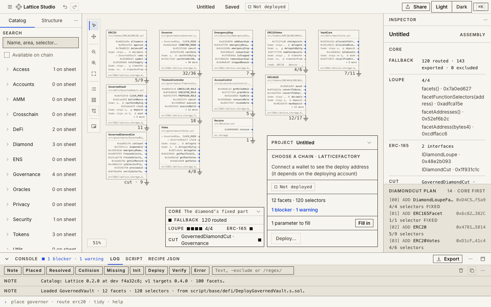
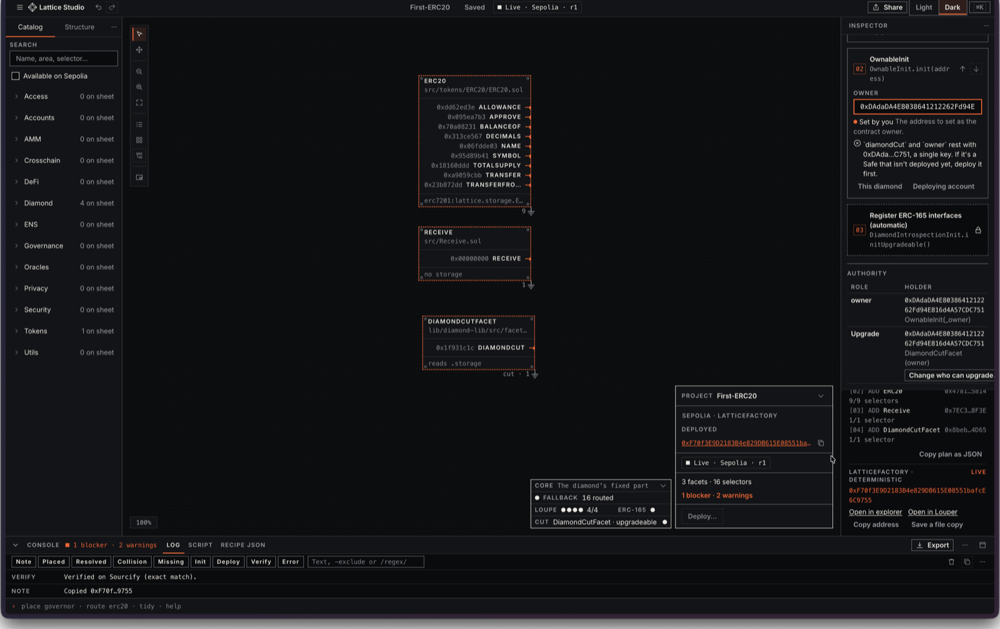
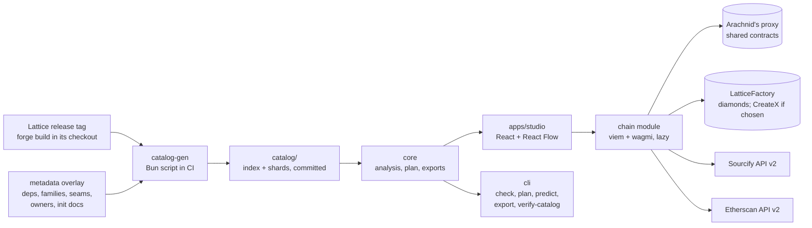

<div align="center">


# Lattice Studio

**The design environment for EIP-2535 diamonds.**

Compose a contract system from facets, catch every mistake on the edit that makes it,<br />
and ship it as a Foundry script, a Safe batch or one verified transaction.

[**Open the app**](https://lattice-studio-topaz.vercel.app) · [Watch the demo](https://youtu.be/Fzei4h-vTQg) · [Architecture](docs/architecture.md) · [Security model](SECURITY.md) · [CLI](packages/cli/README.md)

[](LICENSE)
[](https://eips.ethereum.org/EIPS/eip-2535)
[](https://repo.sourcify.dev/11155111/0xF70f3E9D2183B4e829DB615E08551bafcE6C9755)
[](SECURITY.md#privacy)

</div>

<picture>
  <source media="(prefers-color-scheme: dark)" srcset="apps/studio/public/pitch/sheet-dark.png" />
  
</picture>

Lattice Studio is a static, local-first web app for building modular smart contracts. You place facets from the [Lattice](https://github.com/dadadave80/lattice) library on a sheet, and Studio re-checks the whole diamond on every edit: which facet answers each selector, whether storage namespaces overlap, whether the inits run in a valid order, and who ends up holding the authority to upgrade. When the recipe is clean it ships as a Foundry script, an agent brief, a `recipe.json` or a Safe Transaction Builder batch, or deploys in one transaction to an address Studio predicted first.

Everything shown, checked or exported is a pure function of the recipe plus a catalog generated from a pinned Lattice release. No backend, no accounts, no analytics.

## Why

A diamond is the most flexible way to ship a large contract system on the EVM: one address, no 24 KB limit on the whole, upgradeable facet by facet. It is also the easiest to get wrong. Two facets claim the same selector. Inits run in the wrong order. Storage namespaces overlap. Nobody ends up holding the authority to upgrade. These mistakes usually surface at deploy time or in an audit, after the expensive part is done.

Studio moves them to the moment you make them, and it gives the same answer everywhere the question is asked: on the sheet, in the exported script, in CI and to a coding agent.

## What it does

| | |
| --- | --- |
| **Compose** | 100 facets and 84 recipe templates from Lattice (tokens, governance, access control, DeFi, oracles, crosschain and more) on a sheet where every selector shows the facet that answers it. |
| **Check** | Nine families of checks on every edit: selectors, semantics, the diamond's core, dependencies, storage, inits, authority, links and network. About 2 ms for a 30-facet diamond. Every finding has a rule id (`SEL-01`, `INIT-05`, `LINK-01`) and names its fix. |
| **Export** | A standalone Foundry script, an agent brief, a `recipe.json` with its schema, a Safe Transaction Builder batch, a project file, or a share link that lives in the URL fragment, which a server never sees. |
| **Deploy** | One transaction through LatticeFactory or CreateX. Studio predicts the address, checks each shared contract's codehash against the catalog before you sign, compares the on-chain loupe with the plan afterwards, and verifies the source on Sourcify and, with an API key, on Etherscan. |
| **Bootstrap a chain** | Where Lattice's shared contracts aren't deployed yet, Studio deploys them through Arachnid's proxy at their predicted addresses. |
| **Stay local** | Projects live in your browser. The app works offline after first load. The core never touches a network; only the lazily loaded chain module does, to read a chain you chose, deploy or verify. |

## Proof on Sepolia

A diamond composed, deployed and verified from the hosted app:

| | |
| --- | --- |
| Diamond | [`0xF70f3E9D2183B4e829DB615E08551bafcE6C9755`](https://sepolia.etherscan.io/address/0xF70f3E9D2183B4e829DB615E08551bafcE6C9755), an ERC20: "First Lattice Token" (FLT) |
| Deploy transaction | [`0xc3464766…ade969`](https://sepolia.etherscan.io/tx/0xc3464766712590e02e70444a0835c46dfd8db1c02cabbbd94aea440dddade969), one transaction through LatticeFactory |
| LatticeFactory | [`0xc192cEa531C8FFb3cBE69A98f4795757E4A2c7be`](https://sepolia.etherscan.io/address/0xc192cEa531C8FFb3cBE69A98f4795757E4A2c7be) |
| Source | [Exact match on Sourcify](https://repo.sourcify.dev/11155111/0xF70f3E9D2183B4e829DB615E08551bafcE6C9755), creation and runtime bytecode |

Don't take the app's word for it. The loupe returns the five facets of the plan, in the plan's order:

```sh
cast call 0xF70f3E9D2183B4e829DB615E08551bafcE6C9755 "facetAddresses()(address[])" \
  --rpc-url https://ethereum-sepolia-rpc.publicnode.com
```



## Quickstart

Use the [hosted app](https://lattice-studio-topaz.vercel.app), or run it yourself with [Bun](https://bun.sh):

```sh
git clone https://github.com/dadadave80/lattice-studio.git
cd lattice-studio
bun install --frozen-lockfile
bun dev
```

The app opens on `$STUDIO_PORT` (default 5173), served against the catalog already committed to `catalog/`. No Foundry needed for UI work.

## One core: the app, the CLI and CI

The analysis is one pure-TypeScript package. The app, the CLI and the tests all run it, so the sheet, the exported script and the pipeline cannot disagree.

```console
$ bun packages/cli/src/main.ts check docs/examples/erc20.recipe.json
Provisional catalog: Lattice 0.2.0 at dev f4a32c8; v1 targets 0.4.0
ERC20 · recipe 0x2bbd90227eb2f4de2d758f5a620ae2a30da5ce4019493652eaaf825c4bea1ddb · Lattice dev-f4a32c8
2 facets · 15 selectors
1 warning
  Warning  INIT-05  2 fields still use example values, including name (Example Token) and symbol (EXT).

$ bun packages/cli/src/main.ts plan docs/examples/erc20.recipe.json
Cut plan · the core and 2 facets · 15 selectors
[00] ADD DiamondLoupeFacet 0xD4C5…f5a9 · 4/4 selectors · 0.2.0
[01] ADD ERC165Facet 0x6c82…382C · 1/1 selector · 0.2.0
[02] ADD ERC20 0x4781…5814 · 9/9 selectors · 0.2.0
[03] ADD Receive 0x7EC3…8F3E · 1/1 selector · 0.2.0
Init: calls MultiInit 0x7E28C4D7930b93643CC45fFc2585dd74C6fF8E83
```

`docs/examples/erc20.recipe.json` is the ERC20 recipe template as Studio exports it, checked in so these commands run against a real file. The four addresses in that plan are among the five the Sepolia diamond above reports from its loupe: shared contracts are deployed once, at predicted addresses, and every diamond routes to them.

### For CI and coding agents

Studio has no AI inside it. It is the deterministic checker that pipelines and agents call, so a diamond a model wrote gets the same review as one a person drew.

- `--json` output mirrors the core's `Analysis` type.
- Stable exit codes: `0` no blockers, `1` blockers, `2` invalid input, `3` catalog mismatch.
- `export brief` writes an agent brief in Markdown, for handing a recipe to a coding agent.
- Exports are byte for byte what the app writes for the same recipe, catalog and inputs.

`packages/cli` will ship as `lattice-studio` on npm; until then, run it from a checkout. Full reference: [`packages/cli/README.md`](packages/cli/README.md).

## Architecture

Studio is a Bun monorepo built around that one core. `catalog-gen` runs against a pinned Lattice release; nothing downstream of the catalog reaches back into Lattice.



| Package | Holds |
| --- | --- |
| `packages/catalog-gen` | Builds the catalog inside a Lattice checkout at a release tag, after `FOUNDRY_PROFILE=ci forge build`: facets, selectors, ABIs, ERC-7201 storage ids, init contracts, recipe templates, seams, and per-chain shared-contract addresses |
| `packages/core` | Types and schema, canonical recipe hash, analysis and checks, ownership and seam resolution, cut plan, init encoding, address prediction, exporters, share-link codec, layout. No DOM, no React, no network, no clock, no randomness |
| `packages/tokens` | The design system's `tokens.json` turned into CSS variables, a TypeScript constants file, and a Shiki theme |
| `packages/cli` | `lattice-studio check \| plan \| predict \| export \| verify-catalog`, the same analysis Studio runs in the browser, built for CI and coding agents |
| `apps/studio` | The Vite app: sheet, panels, command palette, persistence, and the lazily loaded chain module |

[`docs/architecture.md`](docs/architecture.md) follows a recipe through open, edit, export and deploy.

## Trust model

Studio's checks run inside the same bundle a compromised build would ship, and [`SECURITY.md`](SECURITY.md) says so plainly. Three paths don't depend on trusting the app:

- **The Foundry script.** Standalone and readable before you run it: no FFI, a header naming the recipe hash, catalog tag and Studio version, and a refusal to broadcast if a codehash, an empty address or the simulated routing doesn't check out.
- **The catalog.** Anyone can rebuild it from the pinned Lattice checkout and compare hashes with `verify-catalog`.
- **LatticeRegistry**, where a chain has one: the factory re-verifies a registered facet's codehash and selectors on-chain before cutting it in.

Around those: a strict Content Security Policy with no `unsafe-inline` or `unsafe-eval`, Subresource Integrity on every script and lazy chunk, and a frozen lockfile with install scripts blocked. An authority address that arrived in a link or a file blocks deploy until you confirm it in full. Studio never asks for a seed phrase or a key and never requests token approvals.

## Engineering

- **3,500+ unit tests** on the core and app logic (`bun test`).
- **1,600+ component tests** in a real browser with screenshot baselines (Vitest Browser Mode).
- **480+ end-to-end flows** in Playwright, with accessibility scans, forced colors and reduced motion. WCAG 2.2 AA is the target.
- **Chain tests** on Anvil, and **golden tests** that hold Studio's plan against Lattice's own deploy scripts.
- **Budgets in one command:** bundle size, schema drift, token drift and copy lint all run in `bun run check`.

The repository was built with coding agents under David Dada's direction; [`AGENTS.md`](AGENTS.md) describes how, and holds the rules for anyone working here now.

## Commands

| Command | Does |
| --- | --- |
| `bun install --frozen-lockfile` | Installs exactly what `bun.lock` pins; install scripts blocked by default |
| `bun dev` | Vite dev server on `$STUDIO_PORT`, against the committed catalog |
| `bun run build` | Production build of `apps/studio` |
| `bun test` | Core logic: analysis, canonical hash, encoders, predictions, codec, migrations |
| `bun run test:browser` | Vitest Browser Mode for components, with screenshot baselines |
| `bun run e2e` | Playwright flows, accessibility scans, forced colors and reduced motion |
| `bun run test:chain` | Anvil and Foundry chain tests |
| `bun run golden` | Foundry-backed golden tests against Lattice's own deploy scripts |
| `bun run catalog` | Rebuilds the catalog from the pinned Lattice checkout (needs Foundry 1.8.3) |
| `bun run typecheck` / `bun run typecheck:ts6` | Type-checks with the fast TS 7 checker, and with TS 6 for tooling parity |
| `bun run lint` | oxlint |
| `bun run check` | Everything static in one run: typecheck (both), lint, size budgets, schema drift, token drift, copy lint |

`bun run golden`, `bun run catalog` and `bun run test:chain` need Foundry 1.8.3 and a Lattice checkout built with the `ci` profile: `FOUNDRY_PROFILE=ci forge build --root lattice`. `bun run test:browser` and `bun run e2e` need Playwright's browsers: `bun x playwright install chromium webkit`.

## Rebuilding and verifying the catalog

The catalog in `catalog/` is generated, not written by hand. To rebuild it from the pinned Lattice checkout:

```sh
bun run catalog
```

CI's `catalog-drift` job runs this and fails if the rebuilt catalog differs from the committed one.

To verify that a committed catalog really was built from the Lattice commit it claims, without trusting this repository's build pipeline, rebuild it independently and compare hashes:

```sh
bun packages/cli/src/main.ts verify-catalog --lattice ../lattice
```

`verify-catalog` needs a Studio checkout under Bun (it reads `overlay/` and `catalog/` from the checkout it runs in) and a separate Lattice checkout at the catalog's tag; a published CLI tarball can't do this on its own.

## Status

Studio is at v1: it composes new Lattice diamonds and deploys them on testnets. The edges, stated plainly:

- **Testnets only.** Sepolia, Base Sepolia, HashKey Chain testnet (chain 133, "HSKChain Testnet" in the picker) and Hedera testnet (chain 296, "Hedera Testnet" in the picker). Mainnet is off in v1, Hedera mainnet included; Lattice and CreateX are both unaudited.
- **HashKey Chain testnet is new.** It was added on October 2, 2026. Nothing has been deployed there from the app yet: Lattice's shared contracts aren't on it, so the first deploy starts with Deploy missing contracts. CreateX isn't deployed there, so only the LatticeFactory path works, and verification runs on Sourcify alone (Etherscan doesn't serve the chain).
- **Hedera testnet is new.** It was added on October 4, 2026. Lattice's shared contracts aren't deployed there yet, so the first deploy starts with Deploy missing contracts, which deploys them through Arachnid's deployment proxy (it's on Hedera testnet). CreateX isn't deployed on Hedera, so only the LatticeFactory path works, and verification runs on Sourcify alone (Etherscan doesn't serve the chain).
- **The catalog is provisional.** It's built from Lattice's `dev` branch at commit `f4a32c8` (Lattice `VERSION` 0.2.0), not yet a tagged release. v1 targets Lattice `v0.4.0`, released through Arachnid's deployment proxy; every shared-contract address in the catalog changes at that re-pin. `check`, `plan` and the app all print "Provisional catalog" while this is true. [`docs/release.md`](docs/release.md) has what re-pinning involves.
- **New diamonds only.** Upgrading a live diamond is v2.
- **The CLI isn't on npm yet.** Run it from a checkout.
- **CI is red for known reasons, none of which fail locally.** The `browser` job has no Linux screenshot baselines yet (every committed one was made on macOS), the Foundry jobs (`golden`, `chain`, `catalog-drift`) fail building the pinned Lattice checkout on the runner, and a `Performance` benchmark misses its budget there. [`docs/release.md`](docs/release.md) has the steps.

## Roadmap

The aim is one place where a contract system is designed, reviewed and shipped, with the same deterministic analysis available to people, pipelines and agents.

- Upgrading live diamonds (v2).
- Re-pinning to the canonical Lattice 0.4.0 release.
- Smart-account recipes, once Lattice ships AccountFactory.
- The CLI on npm, with provenance.
- Mainnet, behind an explicit typed confirmation that names the unaudited code.

## More

- [`docs/architecture.md`](docs/architecture.md): how a recipe becomes a plan, an export and a deploy
- [`docs/release.md`](docs/release.md): versioning, hosting, and the steps David runs to ship a release
- [`CONTRIBUTING.md`](CONTRIBUTING.md): branches, commits, and the pull request checklist
- [`CODE_OF_CONDUCT.md`](CODE_OF_CONDUCT.md): the Contributor Covenant, and where to report a conduct problem
- [`SECURITY.md`](SECURITY.md): the threat model, what the in-app checks can and can't prove, and how to report a problem
- [`AGENTS.md`](AGENTS.md): the rules for people and coding agents working in this repo, and how it was built
- [Lattice](https://github.com/dadadave80/lattice): the facet library Studio composes from, David Dada's earlier open-source work

Licensed under the [MIT License](LICENSE).
