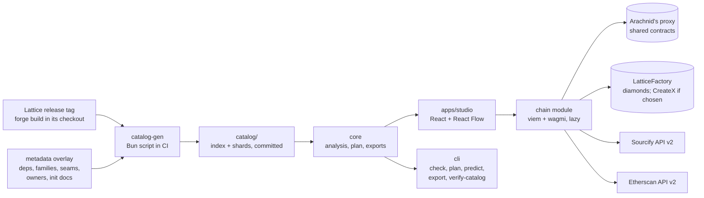

# Lattice Studio

Lattice Studio is a static, local-first web app that composes [EIP-2535](https://eips.ethereum.org/EIPS/eip-2535) diamonds from the [Lattice](https://github.com/dadadave80/lattice) facet library. It draws a recipe of facets on a sheet, checks it on every edit, and ships it as a Foundry script, an agent brief, a `recipe.json`, or a Safe Transaction Builder batch — or deploys it in one transaction. No backend, no accounts, no analytics: everything shown, checked, or exported is a pure function of the recipe plus a catalog generated from a pinned Lattice release.

v1 composes and deploys new plain `Lattice` diamonds on testnets. Upgrading a live diamond is v2.

## Status

- Live app: <https://lattice-studio-topaz.vercel.app> · pitch deck: <https://lattice-studio-topaz.vercel.app/pitch>
- Built September 23–30, 2026 for the EAG Global Buildathon. [Lattice](https://github.com/dadadave80/lattice), the facet library Studio composes from, is David Dada's earlier open-source work and predates the event.
- v1 composes new Lattice diamonds and deploys them on Sepolia, Base Sepolia and HashKey Chain testnet (chain 133, "HSKChain Testnet" in the picker). Mainnet is off.
- HashKey Chain testnet was added on October 2, 2026. Nothing has been deployed there from the app yet: Lattice's shared contracts aren't on it, so the first deploy starts with Deploy missing contracts. CreateX isn't deployed there, so only the LatticeFactory path works, and verification runs on Sourcify alone (Etherscan doesn't serve the chain).
- The catalog is provisional: it's built from Lattice's `dev` branch at `f4a32c8`, not a tagged release (see [Rebuilding and verifying the catalog](#rebuilding-and-verifying-the-catalog)).
- The repository was built with coding agents under David's direction; [`AGENTS.md`](AGENTS.md) describes how.
- CI is red for known reasons, none of which fail locally: the `browser` job has no Linux screenshot baselines yet (every committed one was made on macOS), the Foundry jobs (`golden`, `chain`, `catalog-drift`) fail building the pinned Lattice checkout on the runner, and a `Performance` benchmark misses its budget there. [`docs/release.md`](docs/release.md) has the steps.

## Quickstart

```sh
bun install --frozen-lockfile
bun dev
```

Opens the app on `$STUDIO_PORT` (default 5173), served against the catalog already committed to `catalog/` — no Foundry needed for UI work.

To check a recipe from the command line, before the CLI is published (see [Using the CLI](#using-the-cli)):

```sh
bun packages/cli/src/main.ts check docs/examples/erc20.recipe.json
```

## Commands

| Command | Does |
| --- | --- |
| `bun install --frozen-lockfile` | Installs exactly what `bun.lock` pins; install scripts blocked by default |
| `bun dev` | Vite dev server on `$STUDIO_PORT`, against the committed catalog |
| `bun run build` | Production build of `apps/studio` |
| `bun test` | Core logic: analysis, canonical hash, encoders, predictions, codec, migrations (seconds) |
| `bun run test:browser` | Vitest 5 Browser Mode for components, with screenshot baselines |
| `bun run e2e` | Playwright flows, accessibility scans, forced colors and reduced motion |
| `bun run test:chain` | Anvil and Foundry chain tests |
| `bun run golden` | Foundry-backed golden tests against Lattice's own deploy scripts |
| `bun run catalog` | Rebuilds the catalog from the pinned Lattice checkout (needs Foundry 1.8.3) |
| `bun run typecheck` / `bun run typecheck:ts6` | Type-checks with the fast TS 7 checker, and with TS 6 for tooling parity |
| `bun run lint` | oxlint |
| `bun run check` | Everything static in one run: typecheck (both), lint, size budgets, schema drift, token drift, copy lint |

`bun run golden`, `bun run catalog` and `bun run test:chain` need Foundry 1.8.3 and a Lattice checkout built with the `ci` profile: `FOUNDRY_PROFILE=ci forge build --root lattice`. `bun run test:browser` and `bun run e2e` need Playwright's browsers: `bun x playwright install chromium webkit`.

## Architecture

Studio is a Bun monorepo built around one pure-TypeScript core. The web app, the CLI, and the tests all run the same analysis and exporters, so the sheet, the exported script, and CI cannot disagree. `catalog-gen` runs once, in CI, against a pinned Lattice release; nothing downstream of the catalog reaches back into Lattice.



| Package | Holds |
| --- | --- |
| `packages/catalog-gen` | Builds the catalog inside a Lattice checkout at a release tag, after `FOUNDRY_PROFILE=ci forge build`: facets, selectors, ABIs, ERC-7201 storage ids, init contracts, recipe templates, seams, and per-chain shared-contract addresses |
| `packages/core` | Types and schema, canonical recipe hash, analysis and checks, ownership and seam resolution, cut plan, init encoding, address prediction, exporters, share-link codec, layout. No DOM, no React, no network |
| `packages/tokens` | The design system's `tokens.json` turned into CSS variables, a TypeScript constants file, and a Shiki theme |
| `packages/cli` | `lattice-studio check \| plan \| predict \| export \| verify-catalog`, the same analysis Studio runs in the browser, built for CI and coding agents |
| `apps/studio` | The Vite app: sheet, panels, command palette, persistence, and the lazily loaded chain module |

Only the chain module talks to a network, and only once the person deploys or verifies. `packages/core` never does.

## Rebuilding and verifying the catalog

The catalog in `catalog/` is generated, not written by hand. To rebuild it from the pinned Lattice checkout:

```sh
bun run catalog
```

This needs Foundry 1.8.3 and a Lattice checkout built with the `ci` profile (`FOUNDRY_PROFILE=ci forge build --root lattice`; Lattice picks its profile from that environment variable). CI's `catalog-drift` job runs this and fails if the rebuilt catalog differs from the committed one.

To verify that a committed catalog really was built from the Lattice tag it claims, without trusting this repository's build pipeline, rebuild it independently and compare hashes:

```sh
bun packages/cli/src/main.ts verify-catalog --lattice ../lattice
```

`verify-catalog` needs a Studio checkout under Bun (it reads `overlay/` and `catalog/` from the checkout it runs in) and a separate Lattice checkout at the catalog's tag; a published CLI tarball can't do this on its own.

**The catalog is provisional.** It's built from Lattice's `dev` branch at commit `f4a32c8` (Lattice `VERSION` 0.2.0), not yet a tagged release. v1 targets Lattice `v0.4.0`, released through Arachnid's deployment proxy; every shared-contract address in the catalog changes at that re-pin. `check`, `plan`, and the app all print "Provisional catalog" while this is true. See `docs/release.md` for what re-pinning involves.

## Using the CLI

`packages/cli` ships as `lattice-studio` on npm (not yet published; see `docs/release.md`). It runs the same `@lattice-studio/core` analysis as the app, with `--json` output and stable exit codes, so a project can run `lattice-studio check recipe.json` in CI or hand a recipe to a coding agent.

Full command reference, exit codes, and examples: [`packages/cli/README.md`](packages/cli/README.md). Until it's published, run it from a checkout:

```sh
bun packages/cli/src/main.ts check docs/examples/erc20.recipe.json
bun packages/cli/src/main.ts plan docs/examples/erc20.recipe.json
```

`docs/examples/erc20.recipe.json` is the ERC20 recipe template as Studio would export it, checked in so these commands run against a real file.

## More

- [`docs/architecture.md`](docs/architecture.md) — how a recipe becomes a plan, an export, and a deploy
- [`docs/release.md`](docs/release.md) — versioning, hosting, and the steps David runs to ship a release
- [`CONTRIBUTING.md`](CONTRIBUTING.md) — branches, commits, and the pull request checklist
- [`SECURITY.md`](SECURITY.md) — the threat model, what the in-app checks can and can't prove, and how to report a problem
- [`AGENTS.md`](AGENTS.md) — the rules for people and coding agents working in this repo, and how it was built

Licensed under the [MIT License](LICENSE).
