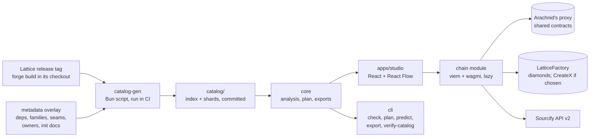

# Architecture

Lattice Studio is a Bun monorepo built around one pure-TypeScript core. The web app, the CLI, and the tests all run the same analysis and exporters, so the sheet, the exported script, and CI cannot disagree with each other. Lattice flows in from one direction only: a release tag becomes a catalog, the catalog feeds the core, and the core feeds everything else. Nothing downstream ever writes back into Lattice or the catalog at runtime.

## Packages

| Package | Holds | Depends on |
| --- | --- | --- |
| `packages/catalog-gen` | Runs inside a Lattice checkout at a release tag, after `FOUNDRY_PROFILE=ci forge build` (Lattice picks its profile from that environment variable, and the `ci` profile emits `storageLayout` and build info). It must build there, not through Studio's own remappings, because a release address commits to exact bytecode and the metadata hash covers source paths. Writes the catalog: facets, selectors, ABIs with errors and events, ERC-7201 ids and slots, init contracts, recipe templates, seams, and per-chain release data. For every shared contract (facets, init contracts, `LatticeRegistry`, `LatticeFactory`) it records the salt, the address through Arachnid's proxy, the runtime codehash, the init-code hash, and the creation code | Foundry, viem utilities |
| `packages/core` | Types and schema, canonical recipe hash, analysis and checks, ownership and seam resolution, cut plan, the init encoder with reference resolution, address prediction for shared contracts and both diamond deploy paths, exporters, the share-link codec, layout, narration, and formatting. No DOM, no React, no network, no clock, no randomness | viem utilities (keccak, ABI encoding), Zod |
| `packages/tokens` | Turns the design system's `tokens.json` into CSS variables for both themes, a TypeScript constants file, and a Shiki syntax-highlighting theme | none |
| `packages/cli` | `lattice-studio check \| plan \| predict \| export foundry\|brief\|recipe\|safe \| verify-catalog`, with `--json` output and stable exit codes | `core`, the built-in catalog |
| `apps/studio` | The Vite app: shell, sheet, panels, command palette, persistence, and the chain module | `core`, catalog, `tokens` |

## Inside the app

| Module | Responsibility |
| --- | --- |
| `shell` | Layout, hash router, title bar, panes, responsive switching |
| `sheet` | React Flow: facet-card nodes, derived edges, notes, tool strip, gestures, Move to… |
| `panels` | Catalog tree, Structure tree, inspector, console drawer with Log, Script, and Recipe JSON tabs |
| `commands` | One registry feeding the palette, console verbs, shortcuts, and menus; the remappable keymap |
| `state` | Document store (undoable, persisted), session store (selection, tool, per-project viewport), settings store |
| `chain` | Lazy boundary: wagmi config, readiness probes, the deploy state machine, receipt and Safe tracking, Sourcify verification |
| `persist` | IndexedDB projects and deployment records in separate stores, file open and save, share links, multi-tab coordination |
| `a11y` | Status announcer, focus management, reduced-motion and forced-colors handling |

## What happens on each action

1. **Open.** The shell paints from static HTML. The catalog index loads from the service worker's cache, the project from IndexedDB, then the analysis and the sheet's nodes and edges are derived from both.
2. **Edit.** A command writes the document store as one undo step. The analysis re-runs, memoized by recipe hash. The console narrates only the difference between the old and new analysis. Persistence writes 750 ms after the last edit, and immediately when the tab hides, closes, or hands over its edit lock.
3. **Export.** Core exporters run on the recipe and catalog directly; nothing about an export depends on what's currently rendered on the sheet. A code view's syntax highlighter loads only when that view opens.
4. **Deploy.** The chain module loads (its own lazy bundle). It probes the chain, snapshots the recipe hash, builds the transaction through `core`, simulates it, asks the wallet to sign, tracks the receipt, checks the result against the plan, verifies the source on Sourcify, and writes a deployment record to its own store.

## Why a catalog, and why it's generated

Lattice's `AGENTS.md` asks for review before adding a runtime dependency or a script language to that repository, so the catalog generator lives here instead, and Lattice itself stays untouched. The catalog is what lets `core` be pure: instead of reading Lattice's Solidity at runtime, every fact about a facet — its selectors, its ABI, what it depends on, what seam it's part of — is precomputed once, in CI, from a specific Lattice release tag, and checked into `catalog/` as data. Two things follow from that:

- **Reproducibility.** Anyone can rebuild the same catalog from the same tag and get the same hash; `verify-catalog` is exactly that rebuild, run independently. See `docs/release.md`.
- **Drift detection.** Because Studio's plan for a recipe is computed from the catalog and Lattice's deploy scripts are the ground truth, the golden tests (`bun run golden`) can compare the two and fail loudly the moment they disagree. See `CONTRIBUTING.md`.

## Where it lives

This repository, with Lattice as a pinned git submodule at `lattice/`; `catalog-gen` runs `forge build` inside that submodule and never writes to it except build output.
